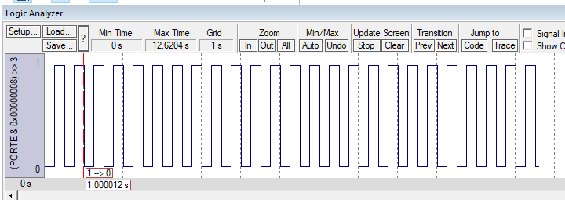

# Lab 3 / 4



## Step 1

Setup 

```nasm
    ; Turn on clock for port E
    LDR  R1, =SYSCTL_RCGCGPIO_R     ; Grab clock location
    LDR  R0, [R1]                   ; Grab clock value
    MOV  R0, #0x10                  ; Bit 5 is for Port E
    STR  R0, [R1]                   ; Store clock values turning on E
    NOP                             ; Wait part1
    NOP                             ; Wait part2
    ; Set PE3 as output
    LDR  R1, =GPIO_PORTE_DIR_R      ; Grab direction location
    LDR  R0, [R1]                   ; Grab direction value
    MOV  R0, #0x8                   ; PE3 as output
    STR  R0, [R1]                   ; Store configuration
    ; Set PE3 as digital
    LDR  R1, =GPIO_PORTE_DEN_R      ; Grab enable register address
    LDR  R0, [R1]                   ; Grab enable register's value
    MOV  R0, #0x8                   ; Set PE3 Pin as enabled
    STR  R0, [R1]                   ; Set enable register as new value
```

Delay Calculation

$$ \frac{80Mhz}{1{sec}} \cdot \frac{1{sec}}{4\space{toggles}} \cdot \frac{1\space{toggle}}{4\space{cycles}} = 5000000{cycles}\space{per}\space{wait}  $$

$$ 5000000_{10} = 0x004C4B40_{16} $$

When attempting to move `0x4C4B40` into register 0, the compiler complains:
```main.s(82): error: A1871E: Immediate 0x004C4B40 cannot be represented by 0-255 shifted left by 0-23 or duplicated in all, odd or even bytes```
So I had to move half the value in (`0x4C`) then move the other half in after (`0x4B40`).

### Delay

```nasm
delay
    MOV  R1, #0x4C                  ; Move high half of Dword into R1
    MOV  R0, #0x4B40                ; Move low half of Dword into R0
    ADD  R0, R0, R1, LSL #0x10      ; Merge the two
wait
    SUBS R0, R0, #0x01              ; (1 cycle)
    BNE  wait                       ; (3 cycles)
    BX   LR                         ; return
```

### Flip PE3

```nasm
flip_PE3
    LDR  R1, =GPIO_PORTE_DATA_R     ; Grab the address for the DATA register for Port E
    LDR  R0, [R1]                   ; Grab the value currently held by the DATA register for Port E
    EOR  R0, R0, #0x08              ; Flip the 4th bit for LED
    STR  R0, [R1]                   ; Store the new data value
    BX   LR                         ; return
```

### Main

```nasm
loop
    BL   delay
    BL   flip_PE3
    B    loop
```

## Step 2

Changes: Moved the delay length to
```nasm
LAB3_STAGE_1_25_PERC EQU 0x4C4B40   ; 5,000,000
```

And added the S
```nasm
LAB3_STAGE_2_15_PERC EQU 0x2DC6C0   ; 3,000,000
LAB3_STAGE_2_35_PERC EQU 0x6ACFC0   ; 7,000,000
```

Then changed the delay function to use R0 as its first parameter.

### Delay

```nasm
delay
    SUBS R0, R0, #0x01              ; Subtract 1 from R0 and set zero flag(1 cycle)(SUB does not set zero flag)
    BNE  delay                      ; Continue delay if R0 is not 0(3 cycles)
    BX   LR                         ; return
```

### Main

```nasm
loop  
    ; main engine goes here
    LDR  R0, =LAB3_STAGE_2_35_PERC  ; 7/20 of a second
    BL   delay                      ;
    BL   flip_PE3                   ;
    LDR  R0, =LAB3_STAGE_2_15_PERC  ; 3/20 of a second
    BL   delay                      ;
    BL   flip_PE3                   ;
    B    loop                       ;
```

## Step 3 

I chose to make my loop increment the duty cycle by 20 percent each time PE2 was pressed and released and only acted on release. Also I chose to end the current delay when doing so, causing odd spikes, but I wanted to see results immidiately.

To do this I had to rework my delay function quite a bit. One problem I ran into was calling subroutines inside subroutines. This made my delay function act irratically. This is something I need to ask the teacher about for future labs. I ended up inlining all my calls to subroutines and it got messy, especially since the structure is still there.

### Delay

```nasm
;~~~~~~~~~~~~~~~~~~~~~~~~~~~~~~~~~~
; R0 = How much to delay by
; R1 = value of data register
; R2 = address of data register
; R3 = Unused
; R4 = Whether or not the button on PE2 was pressed
;   R4:0 is set while pressed
;   R4:1 is set when pressed
;   R4:0 is unset when released
;   R4: 0b0000 -> not pressed
;       0b0011 -> being pressed
;       0b0010 -> was pressed
; R5 = Current Duty Cycle
; R6 = How much to add when the button is pressed
; R7 = 100% duty cycle
delay
button_state
    LDR  R2, =GPIO_PORTE_DATA_R     ; Get the address of the data register
    LDR  R1, [R2]                   ; Get the value of the data register
    AND  R1, R1, #0x4               ; Isolate PE2
    CMP  R1, #0x4                   ; Is PE2 on?
    BEQ  button_state_pressed       ; PE2 is pressed
    AND  R4, R4, #0x2               ; PE2 not pressed -> turn off first bit in R4
    B    button_state_done          ; done 
button_state_pressed                
    ORR  R4, R4, #0x3               ; turn on the first 2 bits
button_state_done
update_duty                         
    AND R4, R4, #3                  ; Zero out all but the first 2 bits (not really neccessary is it?)
    CMP R4, #2                      ; Is the value currently 2
    BNE update_duty_done            ; If R4 != 2 then button not yet pressed or still being pressed
increment
    MOV R4, #0                      ; Clear R4
    ADD  R5, R5, R6                 ; Add 20% to the duty cycle
    CMP  R5, R7                     ; Is the duty cycle <= 100
    BLE  increment_done             ; We done
    SUB  R5, R5, R7                 ; duty cycle -= 100
increment_done
    MOV R0, #1                      ; Set R0 to no more delay
update_duty_done                    
    SUBS R0, R0, #5                 ; Subtract 5 from R0 and set zero flag(SUB does not set zero flag)
    BGT  delay                      ; Continue delay if R0 is not 0
    BX   LR                         ; return
```


### Main

Although not featured here, the setup still lives above this code.

```nasm
;~~~~~~~~~~~~~~~~~~~~~~~~~~~~~~~~~~~
; R0 = argument to delay
; R4 = Whether or not a button was pushed
; R5 = Current Duty Cycle
; R6 = How much to add when the button is pressed
; R7 = 100% duty cycle
main
    MOV  R4, #0                     ; Default value of button being pushed
    LDR  R5, =LAB3_STEP_3_30_PERC   ; DUTY CYCLE : Default duty cycle 30%@2Hz
    LDR  R6, =LAB3_STEP_3_20_PERC   ; DUTY CYCLE STEP : When button pressed, add this to R4
    LDR  R7, =LAB3_STEP_3_100_PERC  ; DUTY CYCLE MOD : Max Duty Cycle 100%@2Hz
loop                                ; ~~~~~~MAIN ENGINE GOES HERE~~~~~~~~
    BL   flip_PE3                   ; Flip the LED on
    MOV  R0, R5                     ; Set delay to the duty cycle
    BL   delay                      ; Delay (LED on)
    BL   flip_PE3                   ; Flip the LED (LED off)
    SUB  R0, R7, R5                 ; Set the delay to the duty cycle minus the total time
    BL   delay                      ; Delay (LED off)
    B    loop                       ; repeat
```

## Step 4

Although I was able to set up the circuit and the effect was essentially the same. The timing was off as expected. By how much I didn't measure.

## Step 5